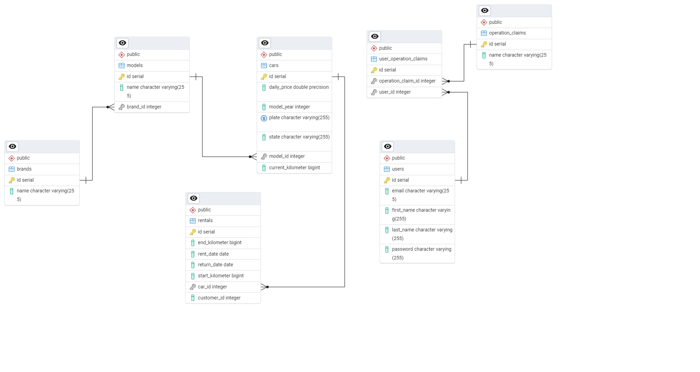
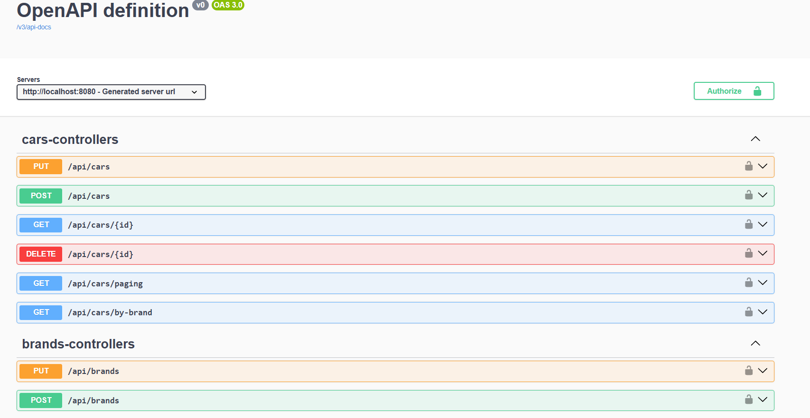
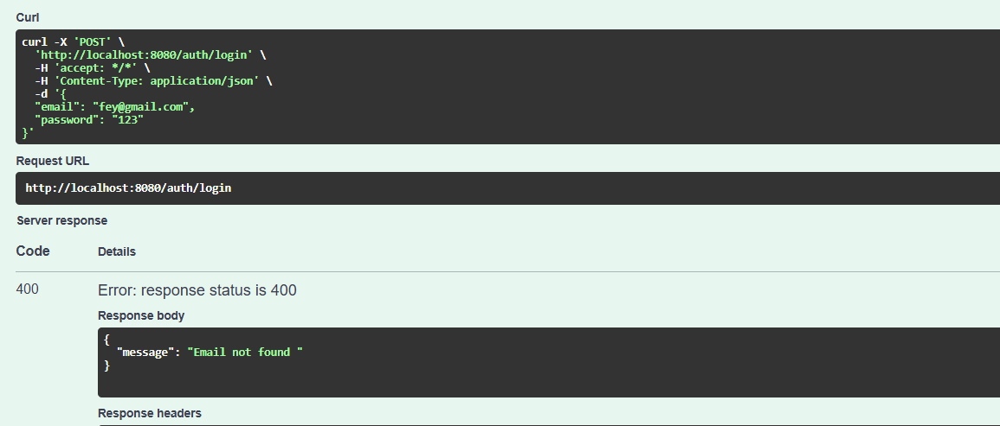

🚗 Rent A Car Backend API

A layered Spring Boot backend application for a Rent A Car system, implementing JWT-based authentication, role-based authorization, Docker containerization, and structured test strategies.

This project was developed to practice clean architecture principles, backend security, database modeling, and testing strategies using modern Spring Boot technologies.

🚀 Features

Layered architecture (Controller – Service – Repository)

RESTful API design

JWT-based authentication

Role-based authorization

BCrypt password hashing

Global exception handling

Docker & Docker Compose support

Unit Testing (Service layer)

Web Layer Testing (Controller layer using MockMvc)

Swagger (OpenAPI 3) documentation

ER Diagram for database modeling

🏗️ Tech Stack

Java 21

Spring Boot

Spring Security

Spring Data JPA

PostgreSQL

JWT (io.jsonwebtoken)

Docker & Docker Compose

JUnit 5

Mockito

MockMvc

OpenAPI 3 (Swagger)

🧱 Architecture

The project follows a layered architecture pattern:

webApi        → Controllers (HTTP Layer)
business      → Services, DTOs, Business Rules
dataAccess    → Repositories
entities      → Domain Models
core          → Security & Exception Handling

Application flow:

Client Request
↓
Controller
↓
Service (Business Logic)
↓
Repository
↓
Database

This structure ensures separation of concerns and maintainability.

🗄️ Database Schema

The relational database design of the system is shown below:

  

Relationship Overview

A Brand can have multiple Models

A Model can have multiple Cars

A User can have multiple Roles (Many-to-Many)

A Rental belongs to one User and one Car

The database is normalized and designed using relational principles.

🔐 Security Architecture

Authentication flow:

Login Request
↓
AuthenticationManager
↓
JWT Token Generation
↓
Client stores token
↓
Authorization Header (Bearer Token)
↓
JWT Filter validates token
↓
SecurityContext updated

Security features include:

JWT token generation and validation

Role-based endpoint protection

BCrypt password hashing

Custom business rule validation

Stateless authentication

📘 API Documentation (Swagger UI)

Interactive API documentation is available via OpenAPI 3.

Access it at:

http://localhost:8080/swagger-ui/index.html

  

⚠️ Error Handling Example

The application implements global exception handling to return meaningful error responses.

Example: Login attempt with a non-existing email

  

🧪 Testing Strategy
✅ Unit Tests (Service Layer)

Dependencies mocked using Mockito

Success and failure scenarios tested

Business rule validations verified

✅ Web Layer Tests (Controller Layer)

Implemented using @WebMvcTest

HTTP request/response validation with MockMvc

Service layer mocked using @MockBean

Security filters disabled in test environment

The test structure demonstrates understanding of:

Unit vs Web Layer testing

Mock vs MockBean differences

Isolated component testing

🐳 Running with Docker
1️⃣ Clone the repository
git clone https://github.com/Feyzaavici/RentACar.git
2️⃣ Start the containers
docker compose up -d
3️⃣ Access the application
http://localhost:8080
💻 Running Locally (IDE Setup)
1️⃣ Create PostgreSQL Database

Database name: 
rentacar
2️⃣ Configure application.properties
spring.datasource.url=jdbc:postgresql://localhost:5432/rentacar
spring.datasource.username=postgres
spring.datasource.password=your_password

jwt.secret=your_secret_key
jwt.expirationMinutes=60
3️⃣ Run the Application

Start RentACarApplication from your IDE.

📚 Key Concepts Practiced

Spring Security configuration

JWT implementation

Role-based authorization

Clean layered architecture

Unit testing with Mockito

Controller testing with MockMvc

Relational database modeling

Docker containerization

🚀 Future Improvements

Integration testing

Test coverage improvement

CI/CD pipeline integration

Logging enhancement

API rate limiting

Refresh token mechanism

🎯 Project Goal

This project demonstrates practical backend development skills including:

Secure authentication & authorization

Scalable layered architecture

Database relationship modeling

Test-driven thinking

Containerized deployment

👩‍💻 Developer

Feyza Avcı
Computer Engineering Student